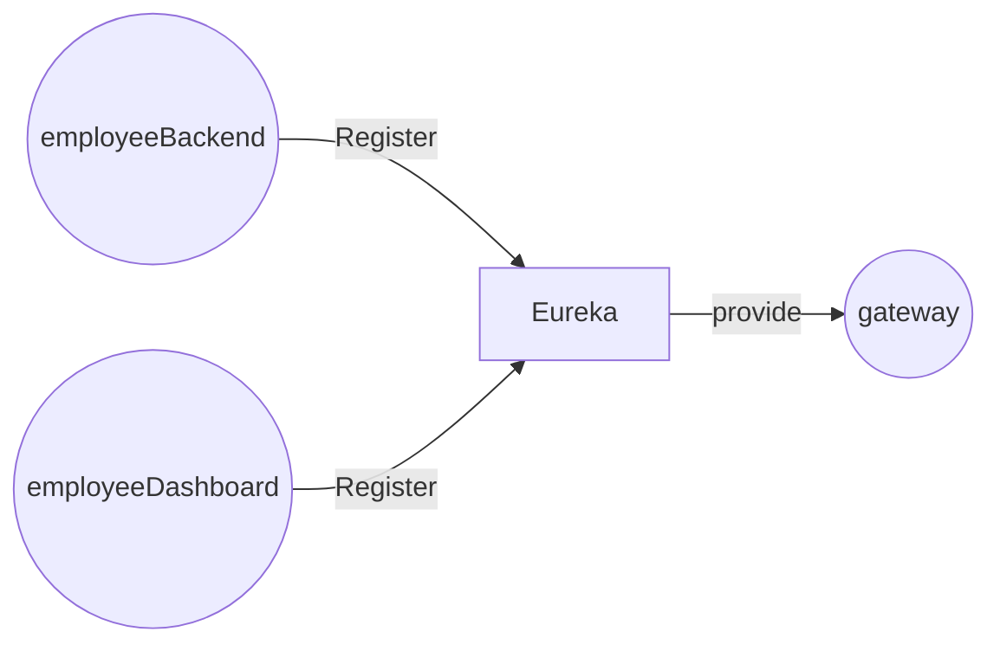

# Welcome to Spring Microservices tutorial!

This project is to learn how to use : 

 - a gateway
 - a config server
 - zuul
 - hystrix
 -
All with the Spring cloud stack!

# Projects

## config server

Manage the configuration outside the application

## eureka
Service registry

## employeeBackend
Simple rest application

## employeeDashboard

Simple rest application calling employeeBackend with Feign using eureka

## gateway

Gateway to call employeeDashboard using eureka

# How to

It's all maven projects.

| Project                                                 | URL                                                        |
|:----------------------------------------------------------|------------------------------------------------------------|
| config server  | http://localhost:9090 |
| eureka  | http://localhost:9091 |
| employeeBackend  | http://localhost:9092 |
| employeeDashboard  | http://localhost:9093 |
| gateway  | http://localhost:9094 |

## Run
You have to start applications in this order : 

 - eureka
 - config server
 - employeeBackend, employeeDashboard, gateway

## Call
To test you can check 

 - http://localhost:9092/employee/find/1 : should return a Json containing employee information
 - http://localhost:9093/dashboard/feign/1 : should return the same thing
 - http://localhost:9094/employeeUI/dashboard/feign/1 : should return the same thing
 - change config file and start new instances (yes i surely have a bug on it or something)

## Next steps
 - Dockerize
 - Kubernetes and so on

